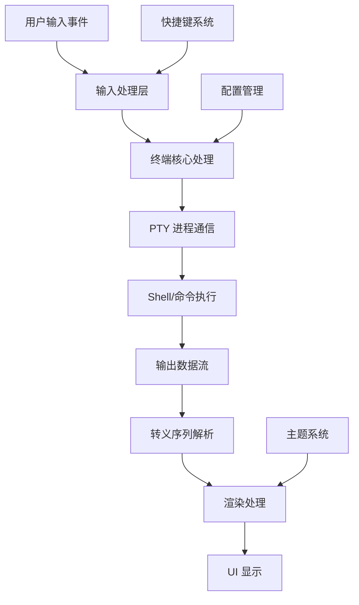

# Magic Terminal 终端数据处理流程文档

## 概述

Magic Terminal 是一个基于 Fyne UI 框架的终端模拟器项目。本文档详细描述了该项目中终端数据处理的完整流程，包括用户输入、数据处理、渲染输出等各个环节。

**注意**: Magic Terminal 是一个终端模拟器，它本身不提供基于历史记录的代码提示功能。代码提示/自动补全功能通常由运行在终端内的 Shell (如 bash、zsh、fish) 或具体的命令行工具（如 git、kubectl 等）提供。Magic Terminal 负责的是准确地传输和显示这些提示信息。

## 架构总览



## 核心数据结构

### Terminal 结构体
```go
type Terminal struct {
    widget.BaseWidget           // Fyne 小组件基类
    fyne.ShortcutHandler       // 快捷键处理
    content      *widget2.TermGrid  // 终端网格内容
    config       Config              // 终端配置
    
    // I/O 处理
    pty io.Closer              // 伪终端接口
    in  io.WriteCloser         // 输入流
    out io.Reader              // 输出流
    
    // 显示状态
    currentFG, currentBG color.Color  // 前景/背景色
    cursorRow, cursorCol int          // 光标位置
    cursor              *canvas.Rectangle  // 光标对象
    
    // 解析状态
    state *parseState          // 当前解析状态
    // ... 其他字段
}
```

### 解析状态结构
```go
type parseState struct {
    code     string    // 当前解析的代码
    esc      int       // 转义序列状态
    osc      bool      // OSC 模式
    vt100    rune      // VT100 字符集模式
    apc      bool      // APC 模式
    printing bool      // 打印模式
}
```

## 输入处理流程

### 1. 用户输入捕获

用户输入通过 Fyne 框架的事件系统捕获，主要包括：

#### 字符输入 (TypedRune)
```go
func (t *Terminal) TypedRune(r rune) {
    b := make([]byte, utf8.UTFMax)
    size := utf8.EncodeRune(b, r)
    _, _ = t.in.Write(b[:size])  // 直接写入输入流
}
```

#### 特殊键输入 (TypedKey)
```go
func (t *Terminal) TypedKey(e *fyne.KeyEvent) {
    switch e.Name {
    case fyne.KeyReturn:
        _, _ = t.in.Write([]byte{'\r'})
    case fyne.KeyF1:
        _, _ = t.in.Write([]byte{asciiEscape, 'O', 'P'})
    // ... 其他特殊键处理
    }
}
```

### 2. 输入数据传输

输入数据通过 PTY (伪终端) 接口传递给底层 Shell 进程：

```
用户输入 → Terminal.in → PTY → Shell 进程
```

## 输出处理流程

### 1. 数据读取循环

终端在 `run()` 方法中持续读取来自 Shell 的输出：

```go
func (t *Terminal) run() {
    buf := make([]byte, bufLen)  // 32KB 缓冲区
    for {
        num, err := t.out.Read(buf)
        // 错误处理...
        
        fyne.DoAndWait(func() {
            leftOver = t.handleOutput(fullBuf[:num])
            if len(leftOver) == 0 {
                t.Refresh()  // 刷新显示
            }
        })
    }
}
```

### 2. 输出数据解析

输出数据解析是整个提示流程的核心部分：

#### 主解析循环
```go
func (t *Terminal) handleOutput(buf []byte) []byte {
    for {
        r, size := utf8.DecodeRune(buf)
        
        // 处理不同类型的字符
        if r == asciiEscape {
            // 开始转义序列处理
            t.state.esc = i
        } else if t.state.esc != noEscape {
            // 继续解析转义序列
            t.parseEscape(r)
        } else if specialChars[r] != nil {
            // 处理特殊字符 (bell, backspace, LF, etc.)
            specialChars[r](t)
        } else {
            // 处理普通可显示字符
            t.handleOutputChar(r)
        }
    }
}
```

#### 转义序列处理
Magic Terminal 支持多种转义序列：

```go
var escapes = map[rune]func(*Terminal, string){
    'A': escapeMoveCursorUp,      // 光标上移
    'B': escapeMoveCursorDown,    // 光标下移
    'C': escapeMoveCursorRight,   // 光标右移
    'D': escapeMoveCursorLeft,    // 光标左移
    'H': escapeMoveCursor,        // 光标定位
    'm': escapeColorMode,         // 颜色/样式设置
    'J': escapeEraseInScreen,     // 清屏
    'K': escapeEraseInLine,       // 清行
    // ... 其他转义序列
}
```

#### 颜色处理
```go
func (t *Terminal) handleColorEscape(message string) {
    modes := strings.Split(message, ";")
    for i, mode := range modes {
        if mode == "38" || mode == "48" {  // 前景/背景色
            // 处理 256 色或 RGB 色彩
            if nextMode == "5" {  // 256 色模式
                t.handleColorModeMap(mode, modes[i+2])
            } else if nextMode == "2" {  // RGB 模式
                t.handleColorModeRGB(mode, modes[i+2], modes[i+3], modes[i+4])
            }
        } else {
            t.handleColorMode(mode)  // 标准 ANSI 色彩
        }
    }
}
```

### 3. 字符渲染

#### 字符放置
```go
func (t *Terminal) handleOutputChar(r rune) {
    // 确保有足够的行
    for len(t.content.Rows)-1 < t.cursorRow {
        t.content.Rows = append(t.content.Rows, widget.TextGridRow{})
    }
    
    // 创建单元格样式
    cellStyle := &widget.CustomTextGridStyle{
        FGColor: t.currentFG, 
        BGColor: t.currentBG
    }
    
    // 处理字符集转换
    if t.useG1CharSet {
        r = charSetMap[t.g1Charset](r)
    } else {
        r = charSetMap[t.g0Charset](r)
    }
    
    // 设置单元格内容
    t.content.SetCell(t.cursorRow, t.cursorCol, 
        widget.TextGridCell{Rune: r, Style: cellStyle})
    t.cursorCol++
}
```

## 渲染流程

### 1. 渲染器架构

Terminal 实现了自定义的 Fyne 渲染器：

```go
type render struct {
    term *Terminal
}

func (r *render) Objects() []fyne.CanvasObject {
    return []fyne.CanvasObject{r.term.content, r.term.cursor}
}

func (r *render) Refresh() {
    r.moveCursor()           // 更新光标位置
    r.term.refreshCursor()   // 刷新光标样式
    r.term.content.Refresh() // 刷新内容
}
```

### 2. 光标管理

```go
func (r *render) moveCursor() {
    cell := r.term.guessCellSize()
    r.term.cursor.Move(fyne.NewPos(
        cell.Width*float32(r.term.cursorCol), 
        cell.Height*float32(r.term.cursorRow)
    ))
}

func (t *Terminal) refreshCursor() {
    t.cursor.Hidden = !t.focused || t.cursorHidden
    if t.bell {
        t.cursor.FillColor = theme.Color(theme.ColorNameError)
    } else {
        t.cursor.FillColor = theme.Color(theme.ColorNamePrimary)
    }
}
```

## 特殊功能处理

### 1. 打印功能
```go
func escapePrinterMode(t *Terminal, code string) {
    if code == "5" {
        t.state.printing = true  // 开始打印模式
    } else if code == "4" {
        // 结束打印模式，输出到打印机
        if t.printer != nil {
            t.printer.Print(t.printData)
        }
        t.state.printing = false
        t.printData = nil
    }
}
```

### 2. 鼠标处理
```go
func escapePrivateMode(t *Terminal, msg string, enable bool) {
    switch mode {
    case "9":  // X10 鼠标协议
        if enable {
            t.onMouseDown = t.handleMouseDownX10
            t.onMouseUp = t.handleMouseUpX10
        }
    case "1000":  // VT200 鼠标协议
        if enable {
            t.onMouseDown = t.handleMouseDownV200
            t.onMouseUp = t.handleMouseUpV200
        }
    }
}
```

### 3. 字符集支持
```go
var charSetMap = map[charSet]func(rune) rune{
    charSetANSII: func(r rune) rune { return r },
    charSetDECSpecialGraphics: func(r rune) rune {
        if m, ok := decSpecialGraphics[r]; ok {
            return m  // 转换为特殊图形字符
        }
        return r
    },
}
```

## 性能优化

### 1. 缓冲机制
- 使用 32KB 输出缓冲区，与现代 L1 缓存对齐
- 批量处理字符以减少系统调用
- 延迟刷新机制避免过度渲染

### 2. 内存管理
- 复用字符单元格对象
- 智能扩展行数组
- 及时清理不需要的数据

### 3. 并发处理
- I/O 读取在独立 goroutine 中进行
- UI 更新通过 `fyne.DoAndWait` 同步到主线程
- 配置变更通过 channel 异步通知

## 错误处理

### 1. I/O 错误
- PTY 连接断开检测
- 优雅的进程退出处理
- 错误状态的用户提示

### 2. 解析错误
- 无效转义序列的跳过
- 调试模式下的详细日志
- 容错性设计确保终端继续工作

## 扩展点

### 1. 自定义转义序列
通过修改 `escapes` 映射表添加新的转义序列支持

### 2. 主题系统
实现 `fyne.Theme` 接口自定义终端外观

### 3. 插件系统
通过 `Printer` 接口扩展打印功能

### 4. 协议支持
通过 `ReadWriterConfigurator` 接口添加新的通信协议

## 代码提示的实际工作机制

虽然 Magic Terminal 本身不提供代码提示功能，但它是代码提示生态系统中的重要组成部分。以下详细说明代码提示在终端环境中的工作原理：

### 1. Tab 补全流程

当用户按下 Tab 键时：

```go
// 在 input.go 中处理 Tab 键
case fyne.KeyTab:
    _, _ = t.in.Write([]byte{'\t'})
```

这个流程是：
1. **用户按 Tab** → Magic Terminal 发送 `\t` 字符
2. **Shell 接收** → 解析当前命令行状态
3. **Shell 生成补全** → 通过内置或外部补全系统
4. **Shell 输出结果** → 可能包含转义序列来更新显示
5. **Magic Terminal 渲染** → 显示补全结果

### 2. 历史记录搜索

反向历史搜索 (Ctrl+R) 的实现：

```go
// 用户按 Ctrl+R
case fyne.KeyR:
    if ctrlPressed {
        _, _ = t.in.Write([]byte{0x12}) // ASCII 控制字符
    }
```

流程：
1. **Magic Terminal** → 发送控制字符给 Shell
2. **Shell** → 进入历史搜索模式
3. **Shell** → 发送提示符更新和搜索界面
4. **Magic Terminal** → 解析并显示搜索界面

### 3. 智能补全示例

以 zsh + oh-my-zsh 为例：

```bash
# 用户输入: git che<Tab>
# Shell 处理流程:
1. 识别 "git" 命令
2. 查找 git 子命令补全规则
3. 匹配 "che" 前缀
4. 发现 "checkout", "cherry-pick" 等选项
5. 发送控制序列更新显示
```

Magic Terminal 在此过程中的角色：
- 准确传输用户的 Tab 输入
- 正确解析 Shell 发送的光标移动、文本插入等控制序列
- 实时更新屏幕显示

### 4. 补全系统的技术实现

#### a) Shell 内置补全
```bash
# bash 示例
complete -F _git git  # 为 git 命令注册补全函数

# zsh 示例  
autoload -U compinit && compinit  # 启用补全系统
```

#### b) 第三方补全框架
```bash
# oh-my-zsh 插件
plugins=(git docker kubectl)

# fish 补全
fish_update_completions
```

#### c) 应用程序集成
```bash
# kubectl 补全
kubectl completion zsh > ~/.zsh/completion/_kubectl

# Docker 补全
docker completion zsh > ~/.zsh/completion/_docker
```

### 5. Magic Terminal 对补全的支持

Magic Terminal 通过以下机制确保补全功能正常工作：

#### 终端能力通告
```go
// 在 term_unix.go 中设置环境变量
env = append(env, "TERM=xterm-256color")
```

这告诉 Shell 支持的终端特性，影响补全显示效果。

#### 光标和屏幕管理
```go
// 支持光标定位，用于补全菜单显示
'H': escapeMoveCursor,        // 光标定位
'J': escapeEraseInScreen,     // 清屏
'K': escapeEraseInLine,       // 清行
```

#### 颜色支持
```go
// 支持彩色补全显示
func (t *Terminal) handleColorEscape(message string) {
    // ... 解析颜色代码
}
```

### 6. 用户体验优化

Magic Terminal 为代码提示提供的用户体验优化：

1. **快速响应**: 32KB 缓冲区确保补全结果快速显示
2. **准确渲染**: 精确的转义序列解析保证补全界面正确显示
3. **字符集支持**: 支持 UTF-8 显示各种语言的补全内容
4. **鼠标支持**: 在支持的 Shell 中可以点击选择补全项

### 7. 调试和问题排查

当代码提示不工作时，可以检查：

```bash
# 检查 TERM 环境变量
echo $TERM

# 检查 Shell 补全配置
# bash:
shopt -s completion
# zsh:
autoload -U compinit && compinit

# 测试基本补全
ls <Tab>
```

Magic Terminal 的调试模式可以帮助诊断问题：
```go
t.SetDebug(true)  // 开启调试模式
```

## 总结

Magic Terminal 的终端数据处理流程是一个完整的终端模拟器实现，包含了从用户输入到屏幕显示的完整数据流。其核心特点包括：

1. **模块化设计**: 输入、解析、渲染各模块职责清晰
2. **协议兼容**: 支持标准的 VT100/ANSI 转义序列
3. **性能优化**: 高效的缓冲和批处理机制
4. **可扩展性**: 良好的接口设计支持功能扩展
5. **用户体验**: 流畅的交互和丰富的功能支持

## 关于代码提示功能的说明

Magic Terminal 作为终端模拟器，其主要职责是：

- **准确传输**: 将用户输入准确传递给 Shell 进程
- **正确显示**: 将 Shell 输出准确渲染到屏幕上
- **协议支持**: 支持各种终端控制序列和特殊功能

**代码提示的实际来源**:

1. **Shell 内置补全**: bash、zsh、fish 等 Shell 的内置 tab 补全
2. **第三方工具**: 如 oh-my-zsh、powerlevel10k 等增强框架
3. **应用程序补全**: git、kubectl、docker 等命令的自补全
4. **历史记录功能**: Shell 的 history 命令和反向搜索 (Ctrl+R)

Magic Terminal 通过精确的终端协议实现，确保这些功能能够正常工作，但它本身不生成或管理代码提示内容。

该流程设计既保证了终端的功能完整性，又维持了良好的性能表现，是现代终端模拟器的优秀实现范例。
